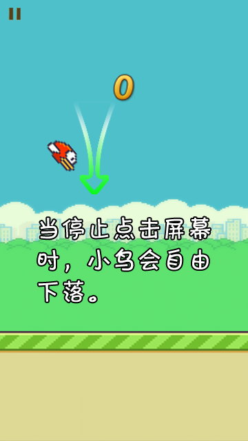
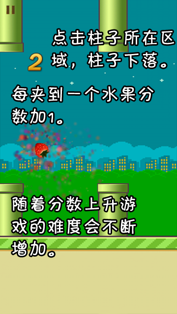
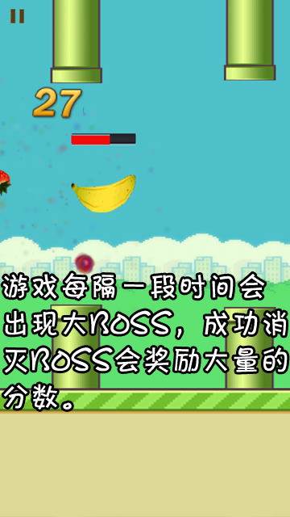

# cocos2d-x 游戏案例
> 代码参考自`《Cocos2d-X 3.x游戏案例开发大全》`，代码中有详细注释，部分代码修改

> cocos2d-x 测试版本为 github 上的 v3 版本，编译测试工程为 proj.android-studio

## 休闲类游戏--Fruit & Bird


## How To Build
#### 创建新工程
```
cocos new FruitandBird -p PACKAGE_NAME -d DIRECTORY --portrait -l cpp
```
`PROJECT_NAME`为工程名称，这里我们填的是`FruitandBird`，`PACKAGE_NAME`替换为你的工程的包名，`DIRECTORY`替换为你的工程存放路径，`--portrait`设置工程为竖屏，`-l cpp`设置工程使用的编程语言为cpp
#### 拷贝源代码和资源文件
进入刚刚新建的工程项目，将本仓库`Classes`下的源文件和`Resources`目录下的资源文件分别复制到相应的目录。
#### 修改 Makefile
找到`proj.android-studio/app/jni/`下的`Android.mk`文件，将里面的这部分
```
LOCAL_SRC_FILES := $(LOCAL_PATH)/hellocpp/main.cpp \
                   $(LOCAL_PATH)/../../../Classes/AppDelegate.cpp \
                   $(LOCAL_PATH)/../../../Classes/HelloWorldScene.cpp
```
修改为
```
LOCAL_SRC_FILES := hellocpp/main.cpp \
                   ../../../Classes/AppDelegate.cpp \
                   ../../../Classes/GameSceneManager.cpp \
                   ../../../Classes/MainLayer.cpp \
                   ../../../Classes/RankBirdLayer.cpp \
                   ../../../Classes/RankFruitLayer.cpp \
                   ../../../Classes/SetLayer.cpp \
                   ../../../Classes/HelpLayer.cpp \
                   ../../../Classes/AboutLayer.cpp \
                   ../../../Classes/GameLayer.cpp \
                   ../../../Classes/BirdLayer.cpp \
                   ../../../Classes/FruitLayer.cpp
```
> Tips: 根据配置的 Android SDK 的不同，你可能还需要修改`cocos2d/cocos/platform/android/libcocos2dx/build.gradle`文件和`proj.android-studio/app/build.gradle`文件里面的`compileSdkVersion`和`buildToolsVersion`的值

#### 编译出apk文件
切换到`FruitandBird`目录下，通过下面的命令编译出apk文件，编译出的文件在`bin/debug/android/FruitandBird-debug.apk`
```
cocos compile -p android --ap android-19 --android-studio
```
`--ap ANDROID_PLATFORM`指定编译 Android 工程所需使用的目标平台，可以到你的 Android SDK 的 platforms 目录下看看，我这里下载的是 android-19


## 游戏介绍
<p align='center'>
  
  
  
  
</p>

## Screenshots
<p align='center'>
  
  
  
<p align='center'>
  
  
  
</p>

## 游戏已完成
  - [x] GameSceneManager(总场景管理器)
  - [x] MainLayer(游戏主界面，6个场景入口菜单项)
  - [x] HelpLayer(帮助界面)
  - [x] SetLayer(设置界面，音乐和音效)
  - [x] RankBirdLayer("进击的小鸟"排行榜界面)
  - [x] RankFruitLayer("水果大逃亡"排行榜界面)
  - [x] AboutLayer(关于界面)
  - [x] GameLayer(游戏选择界面)
  - [x] BirdLayer("进击的小鸟"游戏界面)
  - [x] FruitLayer("水果大逃亡"游戏界面)
  - [x] Collision(碰撞检测)
